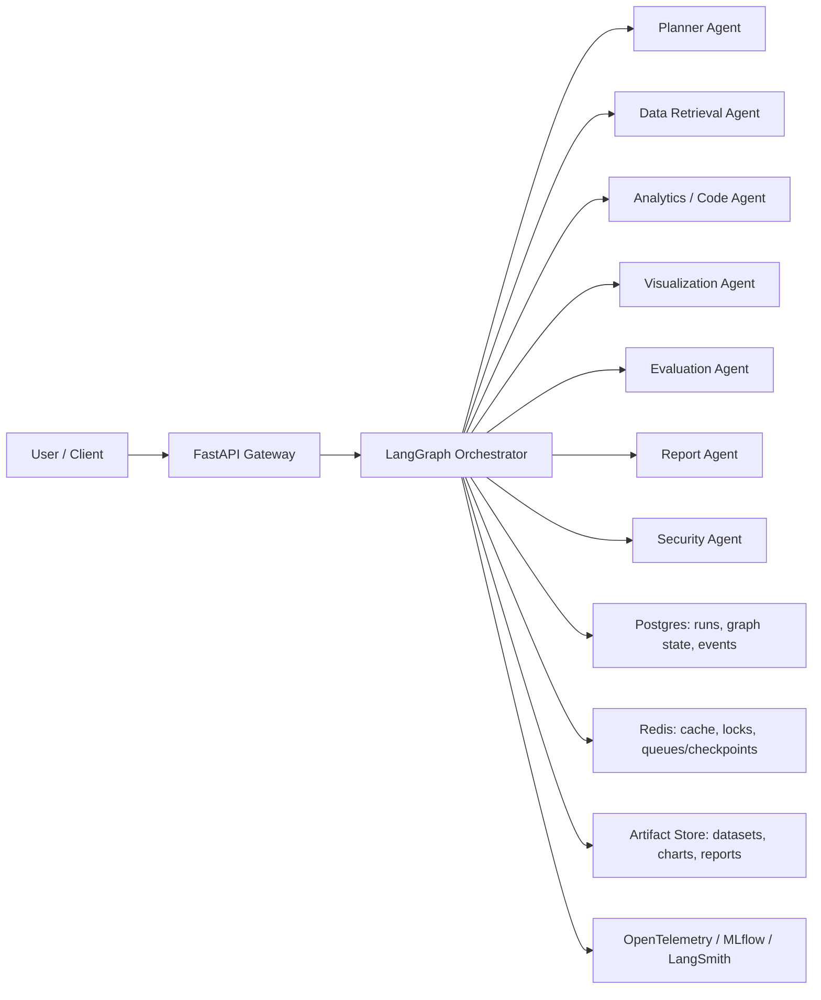

# Autonomous Enterprise AI Operating System Architecture

## Purpose

This document defines the MVP architecture for the Autonomous Enterprise AI Operating System. The platform coordinates specialized AI agents through a durable orchestrator so enterprise analytics work can move from a natural-language request to validated artifacts.

The first production-shaped vertical slice is:

> Analyze a procurement dataset and create a dashboard/report with evaluation results and traceable artifacts.

## MVP Goals

- Accept a natural-language analytics request and an input dataset.
- Generate a structured execution graph before running work.
- Route work across specialized agents with durable state and retries.
- Store every output as a versioned run artifact.
- Evaluate outputs for completeness, data consistency, and grounding.
- Expose run status, artifacts, and evaluation results through an API.
- Emit traces, metrics, and logs for each run and agent step.

## Non-Goals For MVP

- Full Kubernetes production deployment.
- Kafka-based distributed event streaming.
- Provisioning and managing real Snowflake production credentials.
- Multi-cloud deployment automation across AWS and Azure.
- Enterprise SSO, RBAC, tenant isolation, and billing.
- Fine-grained workflow builder UI.
- General-purpose code execution without sandbox restrictions.

These are intentionally deferred until the local/cloud-ready vertical slice is working.

## Architecture Overview



## Core Components

| Component | Responsibility | MVP Notes |
| --- | --- | --- |
| API Gateway | Accept requests, datasets, approvals, and artifact/status queries | FastAPI with Pydantic request/response models |
| LangGraph Orchestrator | Execute agent graph, persist state, handle retries and pauses | Core platform kernel |
| Agent Registry | Map graph node types to executable agent implementations | Static registry for MVP |
| State Store | Persist runs, graph nodes, events, approvals, and evaluations | Postgres |
| Artifact Store | Store input datasets, generated charts, code, dashboards, and reports | Local filesystem by default, S3-compatible payload backend optional |
| Observability Pipeline | Record traces, metrics, logs, evals, and run timing | OpenTelemetry spans with a Prometheus-compatible metrics endpoint |
| Security Layer | Classify tools, enforce approvals, and audit tool calls | Required for code execution and future cloud tools |

## MVP Workflow

1. User submits: "Analyze this procurement dataset and create a dashboard."
2. API creates a `Run` record and stores the uploaded dataset as an input artifact.
3. Planner agent creates an execution graph with node dependencies and expected artifacts.
4. Security agent validates plan risk and tool permissions.
5. Data agent profiles the dataset and emits schema and data quality artifacts.
6. Analytics agent computes procurement KPIs and structured insights.
7. Visualization agent creates charts and a dashboard artifact.
8. Report agent generates a final summary report.
9. Evaluation agent checks chart/report consistency and task completion.
10. Orchestrator marks the run completed or failed and exposes run details through the API.

## Agent Boundaries

| Agent | Inputs | Outputs | Must Not Do |
| --- | --- | --- | --- |
| Planner Agent | User task, dataset metadata, available tools | Execution graph, risk labels, expected artifacts | Execute tools or mutate artifacts |
| Security Agent | Plan, tool calls, user approvals | Allow/deny decision, approval requests, audit events | Rewrite business logic or silently bypass policy |
| Data Retrieval Agent | Dataset artifact, source config | Schema profile, quality report, query-ready dataset reference | Generate charts or final conclusions |
| Analytics / Code Agent | Dataset reference, schema profile, task plan | KPI tables, insight JSON, reproducible analysis code | Run unsafe operations or external network calls without approval |
| Visualization Agent | KPI tables, insight JSON, chart requirements | Chart artifacts, dashboard HTML | Invent data not present in upstream artifacts |
| Evaluation Agent | Plan, outputs, artifacts, dashboard/report | Evaluation scores, failures, warnings | Modify artifacts being evaluated |
| Report Agent | Insights, charts, evaluation summary | Markdown/PDF/HTML report | Claim facts that are not linked to computed outputs |
| Deployment Agent | Validated artifacts, destination config | Stored artifact references, optional deployment metadata | Deploy to external systems in MVP without explicit approval |

## Agent Interface Contract

Each agent should implement a common execution contract:

```python
class AgentInput(BaseModel):
    run_id: str
    node_id: str
    task: str
    context: dict
    artifacts: list[str]
    approvals: list[str]


class AgentOutput(BaseModel):
    status: Literal["succeeded", "failed", "waiting_for_approval"]
    summary: str
    artifacts: list[str]
    events: list[dict]
    metrics: dict
    errors: list[str] = []
```

Agent execution rules:

- Agents read state through the orchestrator context, not directly from unrelated agent internals.
- Agents emit artifacts instead of passing large opaque blobs through graph state.
- Every tool call creates an event.
- Every output artifact records its producer node and source artifact IDs.
- High-risk tool calls return `waiting_for_approval` before execution.
- Generated analysis code is statically validated; the MVP stores reproducible code artifacts and does not dynamically execute arbitrary source.

## Execution Graph Model

The planner should produce a graph shaped like this:

```json
{
  "run_id": "run_123",
  "nodes": [
    {
      "id": "data_profile",
      "agent": "data_retrieval",
      "depends_on": [],
      "task": "Profile procurement dataset",
      "required_tools": ["dataset_reader", "schema_profiler", "quality_checker"],
      "expected_artifacts": ["schema_profile", "quality_report"],
      "risk": "low"
    },
    {
      "id": "analytics",
      "agent": "analytics_code",
      "depends_on": ["data_profile"],
      "task": "Compute procurement KPIs and insights",
      "required_tools": ["dataframe_query", "python_analysis", "code_artifact_writer"],
      "expected_artifacts": ["kpi_table", "code"],
      "risk": "medium"
    }
  ]
}
```

The orchestrator validates this graph before execution:

- Node IDs are unique.
- Dependencies refer to existing nodes.
- Agent names exist in the registry.
- Expected artifact types are known.
- Required tools are explicit so security policy can classify risk before execution.
- Risk levels map to the security policy.
- Cycles are rejected.

## Initial Data Model

### Run

Represents one user-submitted workflow.

| Field | Type | Notes |
| --- | --- | --- |
| id | string | Stable run ID |
| task | text | User request |
| status | enum | pending, running, waiting_for_approval, completed, failed |
| created_at | timestamp | Creation time |
| updated_at | timestamp | Last update time |
| trace_id | string | Observability trace correlation |
| error_summary | text | Nullable |

Every run receives a 32-character trace ID at creation. API responses include the
same value in `x-trace-id` when the run is created inside an HTTP request, and
orchestrator events include the run trace ID for log/trace correlation.

### GraphNode

Represents a planned executable step.

| Field | Type | Notes |
| --- | --- | --- |
| id | string | Stable node ID |
| run_id | string | Parent run |
| agent_type | string | Registry key |
| status | enum | pending, running, waiting_for_approval, completed, failed, skipped |
| depends_on | json | Node dependency IDs |
| required_tools | json | Tool capabilities required by the node |
| expected_artifacts | json | Artifact type list |
| retry_count | integer | Number of retries |
| started_at | timestamp | Nullable |
| finished_at | timestamp | Nullable |

### Artifact

Represents a produced or uploaded file/object.

| Field | Type | Notes |
| --- | --- | --- |
| id | string | Stable artifact ID |
| run_id | string | Parent run |
| producer_node_id | string | Nullable for user input artifacts |
| type | enum | dataset, schema_profile, quality_report, kpi_table, chart, dashboard, report, code, evaluation |
| uri | string | Local path or object URI |
| metadata | json | Size, format, row count, checksums, etc. |
| content_type | string | Nullable MIME/content type from payload storage |
| storage_backend | string | Nullable payload backend such as local or s3 |
| storage_key | string | Nullable backend object key or relative local key |
| size_bytes | integer | Nullable payload size |
| source_artifact_ids | json | Provenance links |
| created_at | timestamp | Creation time |

### AgentEvent

Represents observable agent behavior.

| Field | Type | Notes |
| --- | --- | --- |
| id | string | Event ID |
| run_id | string | Parent run |
| node_id | string | Node that emitted event |
| event_type | string | tool_call, log, approval_request, approval_decision, error |
| payload | json | Structured event details |
| created_at | timestamp | Event time |

### EvaluationResult

Represents validation output for a run or artifact.

| Field | Type | Notes |
| --- | --- | --- |
| id | string | Evaluation ID |
| run_id | string | Parent run |
| target_artifact_id | string | Nullable when run-level |
| score | number | 0.0 to 1.0 |
| passed | boolean | Overall result |
| checks | json | Per-check results |
| created_at | timestamp | Evaluation time |

### Observability Metrics

The MVP exposes Prometheus-compatible text at `GET /metrics`. Metrics are derived
from repository state and include run counts by status, error totals, artifact
count, evaluation count and average score, node retry totals, run duration
summary, and agent node status counts. The OpenTelemetry integration creates
spans for HTTP requests, orchestration entry points, agent node execution, tool
permission decisions, and evaluation result logging.

## Procurement Demo Outputs

The MVP demo should produce:

- Dataset schema profile.
- Data quality report.
- Spend by supplier.
- Spend by category.
- Monthly or quarterly spend trend.
- Outlier or anomaly summary.
- Savings opportunity summary.
- Standalone chart HTML artifacts.
- Dashboard HTML artifact with traceable source artifact IDs.
- Final report artifact with assumptions, limitations, and artifact lineage.
- Evaluation result artifact with pass/fail checks and consistency scores.
- Security audit events for tool permission decisions and approvals.
- Run trace and event log.
- Prometheus-compatible run, artifact, node, retry, and evaluation metrics.

The packaged local demo entry point is `make demo`, backed by
`scripts/run_procurement_demo.py` and `examples/procurement_demo.csv`. It runs the
planner-generated graph end to end and writes `demo_summary.json` plus
`metrics.prom` beside the generated artifacts.

## Suggested Implementation Sequence

1. Scaffold repository and local development environment.
2. Implement API gateway and run lifecycle model.
3. Build LangGraph orchestrator with durable execution.
4. Implement planner agent and graph contract.
5. Implement data ingestion and retrieval agent.
6. Implement analytics/code agent.
7. Implement visualization agent and dashboard artifacts.
8. Implement report agent.
9. Implement evaluation and security gates.
10. Add observability instrumentation.
11. Package the procurement demo.
