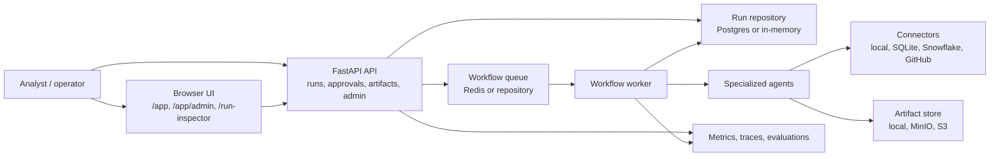
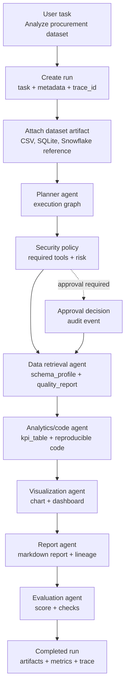
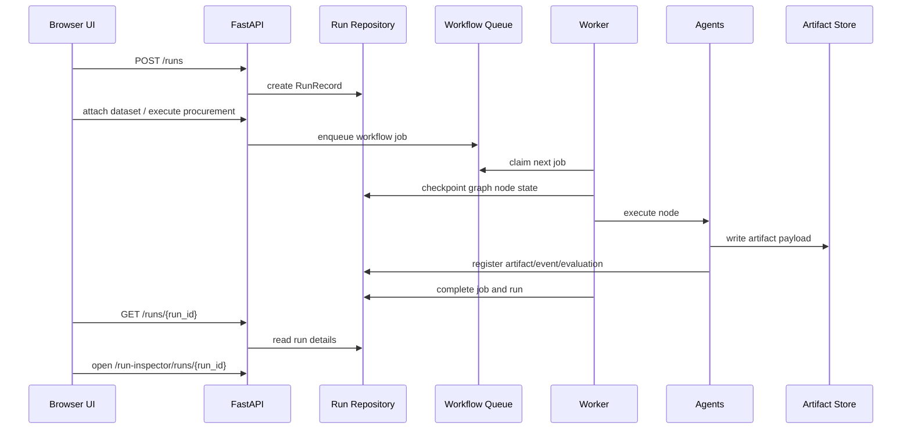
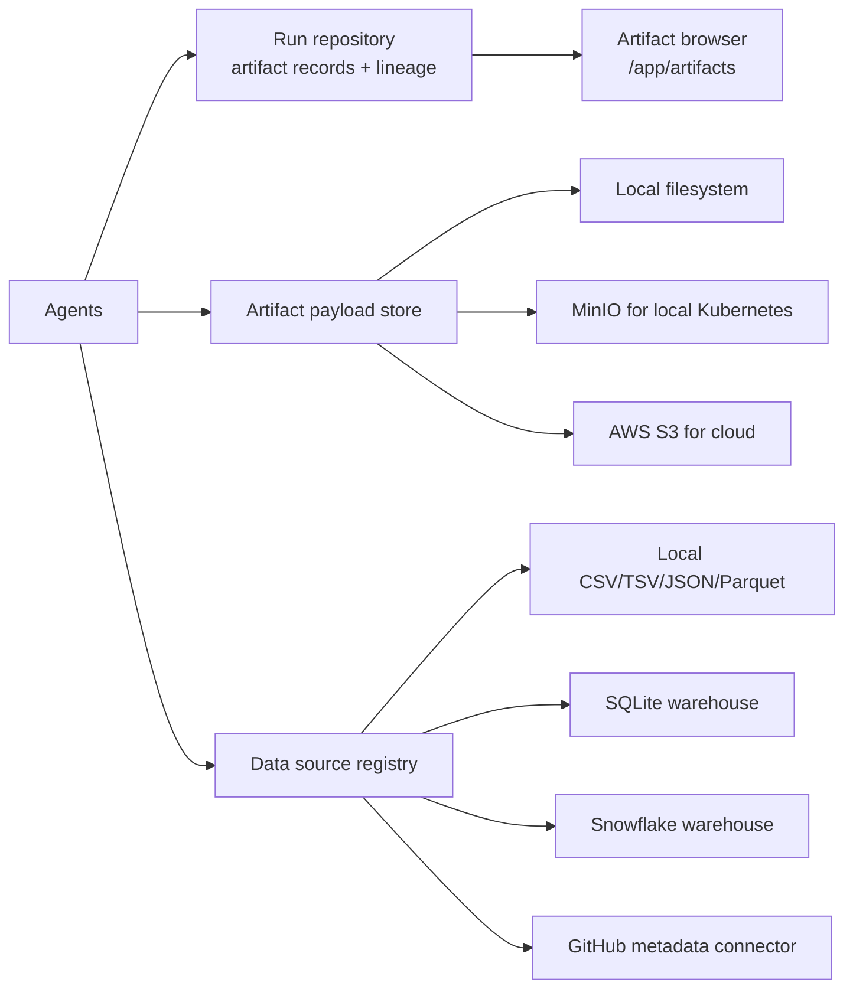
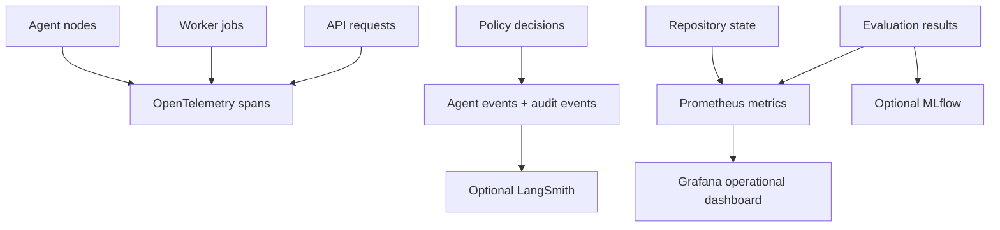
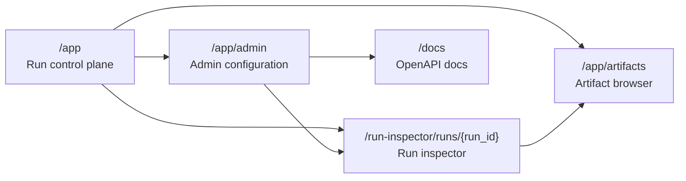

# Portfolio Architecture Overview

Autonomous Enterprise AI OS is a production-shaped multi-agent workflow platform for enterprise
analytics. It turns a natural-language request plus a dataset into validated dashboard, report,
code, metric, and evaluation artifacts while preserving run state, lineage, security decisions, and
observability metadata.

The current vertical slice is intentionally concrete:

> Analyze a procurement dataset and create a dashboard/report with evaluation results and traceable
> artifacts.

## Executive Summary

The platform demonstrates five engineering capabilities in one system:

- Multi-agent orchestration with planner-generated execution graphs.
- Durable workflow state for runs, graph nodes, jobs, approvals, retries, artifacts, events, and
  evaluations.
- Enterprise integration boundaries for local files, SQLite warehouses, Snowflake, GitHub, and
  S3-compatible artifact storage.
- Security governance through tool permission policy, approval gates, audit events, and redaction.
- Operations readiness through FastAPI, worker processes, Redis queueing, Postgres persistence,
  OpenTelemetry traces, Prometheus metrics, Grafana dashboards, Kubernetes overlays, and an AWS
  deployment path.

## System Context



The browser UI and API are the control plane. The worker and agents are the execution plane. The
repository, queue, artifact store, connectors, and observability integrations are shared platform
services.

## Component Responsibilities

| Component | Responsibility | Current implementation |
| --- | --- | --- |
| FastAPI API | Create runs, attach datasets, execute workflows, expose run state, manage approvals, serve UI, expose admin/configuration views | `src/aeai_os/api` |
| Workflow queue | Decouple API requests from long-running agent work | Repository queue locally, Redis queue in Kubernetes/cloud |
| Workflow worker | Claim queued jobs, execute procurement workflow, heartbeat ownership, handle retry/dead-letter state | `scripts/run_workflow_worker.py`, `aeai_os.workflows.worker` |
| Orchestrator | Validate and execute graph nodes, enforce dependency order, persist checkpoints, pause for approvals, retry failures | `aeai_os.orchestration` |
| Agent registry | Declare available agent types, descriptions, risk profiles, and capabilities | `aeai_os.agents.registry` |
| Security policy | Classify tool permissions, block destructive tools, require approvals, emit audit-friendly decisions | `aeai_os.security.policy` |
| Run repository | Store runs, graph nodes, workflow jobs, artifacts, events, audit events, evaluations, and checkpoints | In-memory or SQLAlchemy/Postgres |
| Artifact storage | Store payloads and metadata with lineage links | Local filesystem or S3-compatible store |
| Connector registry | Expose configured enterprise integrations and credential profile health | Local file, SQLite, Snowflake, artifact store, GitHub |
| Observability | Correlate runs through trace IDs, metrics, evaluations, optional MLflow/LangSmith, Grafana dashboards | OpenTelemetry, Prometheus metrics, MLflow/LangSmith adapters |
| Deployment | Package runtime for Docker Compose, Kubernetes overlays, and AWS infrastructure | Docker Compose, kustomize, Terraform for AWS |

## Procurement Workflow Graph



Every graph node declares:

- `agent`: registry key such as `data_retrieval`, `analytics_code`, or `evaluation`
- `depends_on`: upstream node IDs
- `required_tools`: policy inputs, for example `dataset_reader`, `python_analysis`, or
  `deploy_artifact`
- `expected_artifacts`: outputs the node is expected to register
- `risk`: low, medium, or high

The graph is validated before execution. Unknown agents, missing dependencies, cycles, invalid
artifact types, and unsafe tool requirements fail early.

## Agent Responsibilities

| Agent | Input | Output | Review signal |
| --- | --- | --- | --- |
| Planner | User task, dataset artifact metadata, available agents/tools | Execution graph | Valid graph with explicit dependencies and expected artifacts |
| Data retrieval | Dataset artifact or connector-backed source | Schema profile, quality report | Dataset is readable and queryable |
| Analytics/code | Dataset query contract and schema profile | KPI table, insight metadata, reproducible code artifact | Code is statically screened and KPIs are deterministic |
| Visualization | KPI table and task context | Chart and dashboard HTML artifacts | Visual artifacts link back to source KPI artifact |
| Report | Upstream artifacts and task context | Markdown report artifact | Claims are grounded in computed outputs |
| Evaluation | Dashboard, report, KPI, chart, task context | Evaluation record and evaluation artifact | Pass/fail score with structured checks |
| Security | Required tool, risk, connector/artifact context | Allow, block, retry, escalate, or approval-required decision | Tool event and audit trail are recorded |
| Deployment | Reviewed artifacts and destination | Deployment workflow job/artifact | Human approval required before promotion |

## API, Worker, And State Flow



Local demos can run synchronously in one process. Production-style deployments use async mode: the
API enqueues jobs and workers process them outside the request lifecycle.

## Storage, Connectors, And Lineage



Artifacts carry `run_id`, `producer_node_id`, `type`, `uri`, `metadata`, payload storage metadata,
and `source_artifact_ids`. That gives dashboard/report/evaluation outputs lineage back to the input
dataset and intermediate KPI/chart artifacts.

Credential profiles are environment-backed references. API responses expose configured/missing
environment keys, not secret values. Secret-like metadata is redacted in API responses and run
archives.

## Observability And Operations



Operational surfaces:

- `/health`: API health and tracing configuration status
- `/metrics`: Prometheus-compatible run, artifact, evaluation, retry, duration, and node metrics
- `/app`: run creation and run list
- `/app/artifacts`: artifact browser with safe dashboard/report previews
- `/app/admin`: registered agents, connector health, credential profiles, policies, affected runs
- `/run-inspector/runs/{run_id}`: graph nodes, events, timeline, approvals, deployments, lineage
- Grafana dashboard: `deploy/grafana/provisioning/dashboards/aeai-operational-dashboard.json`

## UI Map



The UI is served by the FastAPI app as static assets, so a reviewer can run one local API process
and inspect the control plane, artifacts, admin state, OpenAPI docs, and run details in a browser.

## Setup Paths

| Path | Command entry point | Use when |
| --- | --- | --- |
| Local Python | `make install`, `make dev`, `make demo` | Fastest way to review workflow behavior and generated artifacts |
| Docker Compose | `docker compose up --build` | Review API, worker, Postgres, Redis, MinIO, Prometheus, and Grafana together |
| Kubernetes local | `kubectl apply -k deploy/kubernetes/overlays/local` | Review production-style API/worker separation in kind or minikube |
| Kubernetes staging | `kubectl apply -k deploy/kubernetes/overlays/staging` | Exercise auth, Redis queue, MinIO artifacts, OTLP config, and multiple replicas |
| AWS cloud | `deploy/cloud/aws/terraform` + `deploy/kubernetes/overlays/production` | Provision EKS, RDS, Redis, S3, Secrets Manager, and deploy the production overlay |

Validation commands:

```bash
make lint
make test
make smoke
make demo
make k8s-validate
make cloud-validate
```

## Demo Flow For Reviewers

1. Run `make demo`.
2. Note the printed `run_id`, `trace_id`, dashboard path, report path, evaluation artifact, metrics
   path, and `demo_summary.json`.
3. Run `make dev`.
4. Open `http://127.0.0.1:8000/app` to create or inspect runs.
5. Open `http://127.0.0.1:8000/app/artifacts` to inspect generated dashboards, charts, reports,
   lineage, and safe download links.
6. Open `http://127.0.0.1:8000/app/admin` to inspect registered agents, connectors, credential
   profiles, tool permissions, policy rules, and affected runs.
7. Open `http://127.0.0.1:8000/run-inspector/runs/{run_id}` to review graph nodes, events,
   approvals, deployment history, evaluations, and artifact lineage.
8. Open `http://127.0.0.1:8000/metrics` or Grafana to review operational signals.

Expected demo artifacts:

- Dataset schema profile
- Data quality report
- KPI table
- Reproducible analytics code
- Chart HTML
- Dashboard HTML
- Markdown report
- Evaluation artifact and persisted evaluation record
- Event stream with tool, approval, and policy decisions
- Prometheus-compatible metrics

## What Makes It Enterprise-Shaped

- Durable state: API and worker can share Postgres-backed repository state.
- Async execution: API requests can enqueue work while workers process jobs independently.
- Auditability: policy decisions, approvals, retries, and artifacts are attached to runs.
- Integration boundaries: connectors and credential profiles are explicit and inspectable.
- Deployment maturity: Docker Compose, Kubernetes overlays, runtime config validation, and AWS
  infrastructure are documented and validated in CI.
- Observability: trace IDs connect API calls, workflow execution, agent nodes, metrics, and
  evaluation results.
